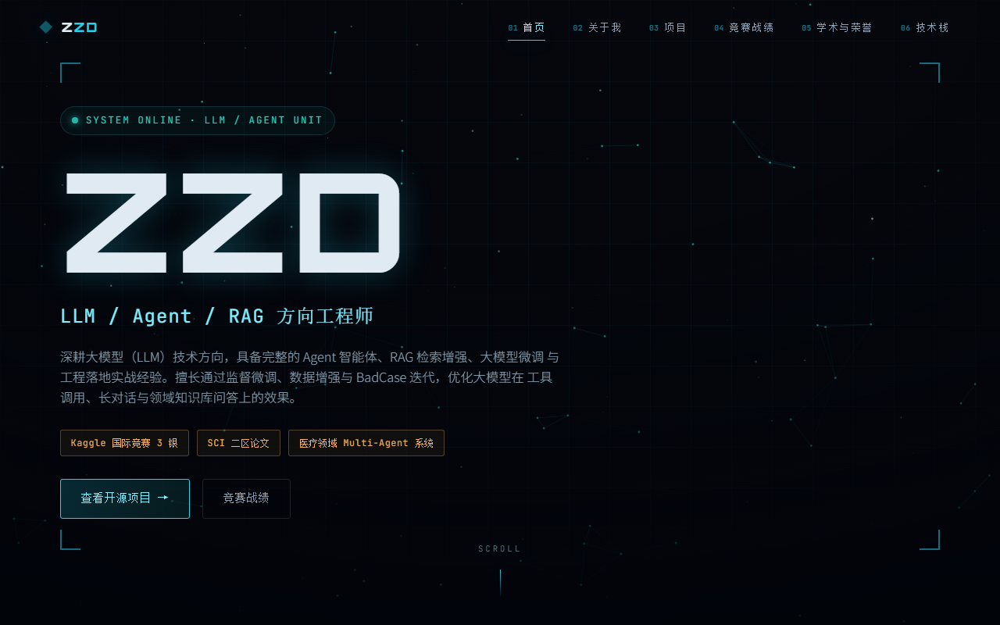

# Personal Site · 个人主页

一个零依赖的单页个人主页：科幻 HUD 风格，纯 HTML/CSS/JS，**双击 `index.html` 即可打开**，
不需要 npm、不需要构建、不需要服务器。

[](LICENSE)



## 内容模块

页面自上而下包含：

1. **Boot 加载动画** —— 打字机式开机自检
2. **Hero 首屏** —— 姓名 + 角色轮播 + 星空/星座 Canvas 粒子背景
3. **数据概览** —— 数字滚动计数器（Kaggle 银牌 / 开源项目 / SCI 论文 / 证书）
4. **关于我** —— 技术方向 + 硕士阶段医疗领域 Agent 系统课题
5. **开源项目** —— 4 个项目的卡片与 GitHub 链接
6. **Kaggle 竞赛战绩** —— 时间线，数据在 `script.js` 顶部的 `KAGGLE` 中
7. **学术与荣誉** —— SCI 二区论文、专业证书与校内荣誉
8. **技术栈** —— 大模型&微调 / Agent&检索 / 工程&基础
9. **Footer**

交互细节：`IntersectionObserver` 滚动揭示、导航 scroll-spy 高亮、响应式布局。

## 本地预览

```bash
# 方式一：直接双击
index.html

# 方式二：起个静态服务器（推荐，避免个别浏览器对 file:// 的限制）
python -m http.server 8080
# 打开 http://127.0.0.1:8080
```

## 改成你自己的

**姓名**分布在 4 处，改成你自己的名字需要一起替换：

| 位置 | 内容 |
|---|---|
| `index.html` | `<title>`、`.brand-text`、`.hero-name`（含 `data-text`）、`.footer-brand` |
| `script.js` | `bootSequence()` 里最后一行的 `welcome, ZZD.` |

其余内容：

| 想改什么 | 改哪里 |
|---|---|
| 开源项目卡片 | `index.html` 的 `#projects` 区块（GitHub 链接按 `zzdjjdd` 填写，**用户名不同需替换**） |
| Kaggle 竞赛记录 | `script.js` 顶部的 `KAGGLE` 数组 |
| 角色轮播词 | `script.js` 顶部的 `ROLES` 数组 |
| 数字概览 | `index.html` 中 `.stat-num` 的 `data-count` |
| 技术方向 / 课题介绍 | `index.html` 的 `#about` 区块 |
| 论文标题与 DOI | `index.html` 的 `#academic` 区块（已留注释，取消注释填入即可） |
| 技术栈标签 | `index.html` 的 `#stack` 区块 |
| 配色主题 | `styles.css` 顶部的 CSS 变量（`--cyan` 等） |

> 新增区块时记得同步两处：`nav-links` 里的导航项，以及该 section 的
> `section-idx` 编号（当前为 02–06，需保持连续）。

## 文件说明

```
.
├── index.html                  # 页面结构
├── script.js                   # 交互逻辑（数据渲染 / Canvas / 滚动动画）
├── styles.css                  # Sci-Fi HUD 主题，CSS 变量集中管理
├── preview.png                 # README 预览图（headless 渲染生成）
├── P1_Vibe coding的接入和使用.md # 配套讲义：Vibe Coding 的接入与使用
└── LICENSE
```

## License

[MIT](LICENSE) © 2026 zzdjjdd
